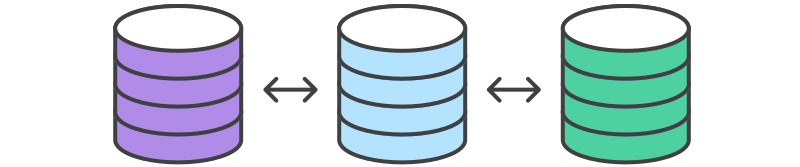

# Comparing Workflows

* [Centralized Workflow](en/centralized_workflow/)
* [Feature Branch Workflow](en/feature_branch_workflow/)
* [Gitflow Workflow](en/gitflow_workflow/)
* [Forking Workflow](en/forking_workflow/)

The array of possible workflows can make it hard to know where to begin when implementing Git in the workplace. This page provides a starting point by surveying the most common Git workflows for enterprise teams.

As you read through, remember that these workflows are designed to be guidelines rather than concrete rules. We want to show you what’s possible, so you can mix and match aspects from different workflows to suit your individual needs.

# 比较 Git 工作流

* [集中式工作流](cn/centralized_workflow/)
* [功能分支工作流](cn/feature_branch_workflow/)
* [Gitflow 工作流](cn/gitflow_workflow/)
* [Forking 工作流](cn/forking_workflow/)

工作流有各式各样的用法，但也正因此使得在实际工作中如何上手使用变得很头大。这篇指南通过总览公司团队中最常用的几种Git工作流让大家可以上手使用。

在阅读的过程中请记住，本文中的几种工作流是作为方案指导而不是条例规定。在展示了各种工作流可能的用法后，你可以从不同的工作流中挑选或揉合出一个满足你自己需求的工作流。
