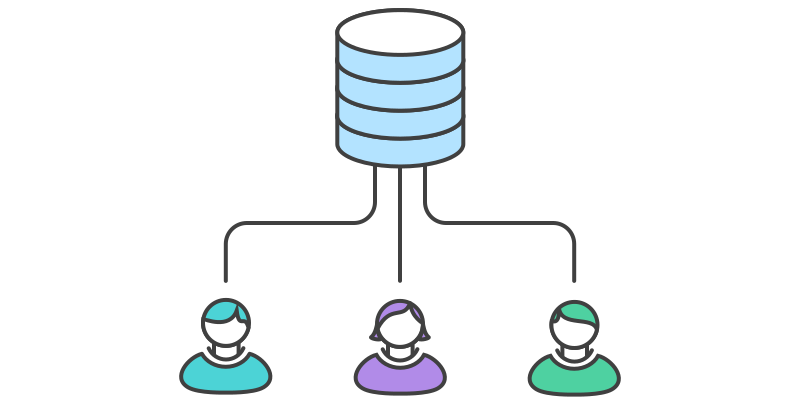
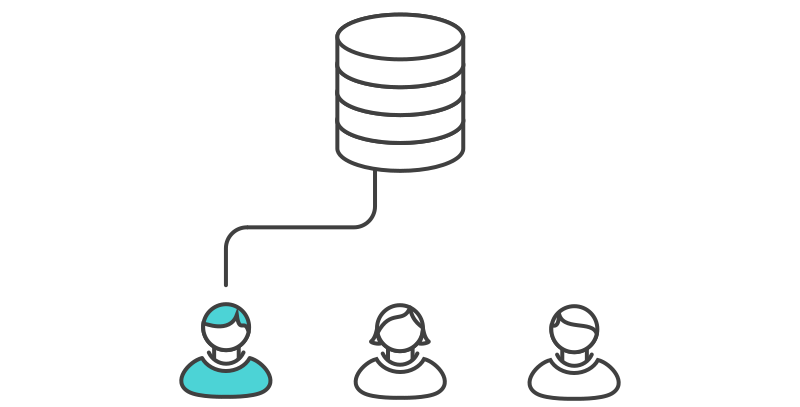

# Example

Let’s take a step-by-step look at how a typical small team would collaborate using this workflow. We’ll see how two developers, John and Mary, can work on separate features and share their contributions via a centralized repository.

## Someone initializes the central repository


First, someone needs to create the central repository on a server. If it’s a new project, you can initialize an empty repository. Otherwise, you’ll need to import an existing Git or SVN repository.

Central repositories should always be bare repositories (they shouldn’t have a working directory), which can be created as follows:

```shell
ssh user@host git init --bare /path/to/repo.git
```
Be sure to use a valid SSH username for user, the domain or IP address of your server for host, and the location where you'd like to store your repo for /path/to/repo.git. Note that the .git extension is conventionally appended to the repository name to indicate that it’s a bare repository.

## Everybody clones the central repository



Next, each developer creates a local copy of the entire project. This is accomplished via the git clone command:

```shell
git clone ssh://user@host/path/to/repo.git
```

When you clone a repository, Git automatically adds a shortcut called origin that points back to the “parent” repository, under the assumption that you'll want to interact with it further on down the road.


## John works on his feature


In his local repository, John can develop features using the standard Git commit process: edit, stage, and commit. If you’re not familiar with the staging area, it’s a way to prepare a commit without having to include every change in the working directory. This lets you create highly focused commits, even if you’ve made a lot of local changes.

```shell
git status # View the state of the repo
git add <some-file> # Stage a file
git commit # Commit a file</some-file>
```

Remember that since these commands create local commits, John can repeat this process as many times as he wants without worrying about what’s going on in the central repository. This can be very useful for large features that need to be broken down into simpler, more atomic chunks.

## Mary works on her feature


Meanwhile, Mary is working on her own feature in her own local repository using the same edit/stage/commit process. Like John, she doesn’t care what’s going on in the central repository, and she really doesn’t care what John is doing in his local repository, since all local repositories are private.

## John publishes his feature



Once John finishes his feature, he should publish his local commits to the central repository so other team members can access it. He can do this with the git push command, like so:

```shell
git push origin master
```

Remember that origin is the remote connection to the central repository that Git created when John cloned it. The master argument tells Git to try to make the origin’s master branch look like his local master branch. Since the central repository hasn’t been updated since John cloned it, this won’t result in any conflicts and the push will work as expected.

## Mary tries to publish her feature


Let’s see what happens if Mary tries to push her feature after John has successfully published his changes to the central repository. She can use the exact same push command:

```shell
git push origin master
```

But, since her local history has diverged from the central repository, Git will refuse the request with a rather verbose error message:

```shell
error: failed to push some refs to '/path/to/repo.git'
hint: Updates were rejected because the tip of your current branch is behind
hint: its remote counterpart. Merge the remote changes (e.g. 'git pull')
hint: before pushing again.
hint: See the 'Note about fast-forwards' in 'git push --help' for details.
```

This prevents Mary from overwriting official commits. She needs to pull John’s updates into her repository, integrate them with her local changes, and then try again.

## Mary rebases on top of John’s commit(s)


Mary can use git pull to incorporate upstream changes into her repository. This command is sort of like svn update—it pulls the entire upstream commit history into Mary’s local repository and tries to integrate it with her local commits:

```shell
git pull --rebase origin master
```

The --rebase option tells Git to move all of Mary’s commits to the tip of the master branch after synchronising it with the changes from the central repository, as shown below:


The pull would still work if you forgot this option, but you would wind up with a superfluous “merge commit” every time someone needed to synchronize with the central repository. For this workflow, it’s always better to rebase instead of generating a merge commit.

## Mary resolves a merge conflict


Rebasing works by transferring each local commit to the updated master branch one at a time. This means that you catch merge conflicts on a commit-by-commit basis rather than resolving all of them in one massive merge commit. This keeps your commits as focused as possible and makes for a clean project history. In turn, this makes it much easier to figure out where bugs were introduced and, if necessary, to roll back changes with minimal impact on the project.

If Mary and John are working on unrelated features, it’s unlikely that the rebasing process will generate conflicts. But if it does, Git will pause the rebase at the current commit and output the following message, along with some relevant instructions:

```shell
CONFLICT (content): Merge conflict in <some-file>
```


The great thing about Git is that anyone can resolve their own merge conflicts. In our example, Mary would simply run a git status to see where the problem is. Conflicted files will appear in the Unmerged paths section:

```shell
# Unmerged paths:
# (use "git reset HEAD <some-file>..." to unstage)
# (use "git add/rm <some-file>..." as appropriate to mark resolution)
#
# both modified: <some-file>
```

Then, she’ll edit the file(s) to her liking. Once she’s happy with the result, she can stage the file(s) in the usual fashion and let git rebase do the rest:

```shell
git add <some-file>
git rebase --continue
```

And that’s all there is to it. Git will move on to the next commit and repeat the process for any other commits that generate conflicts.

If you get to this point and realize and you have no idea what’s going on, don’t panic. Just execute the following command and you’ll be right back to where you started before you ran [git pull --rebase](/tutorials/syncing/git-pull):

```shell
git rebase --abort
```

## Mary successfully publishes her feature'


After she’s done synchronizing with the central repository, Mary will be able to publish her changes successfully:

```shell
git push origin master
```