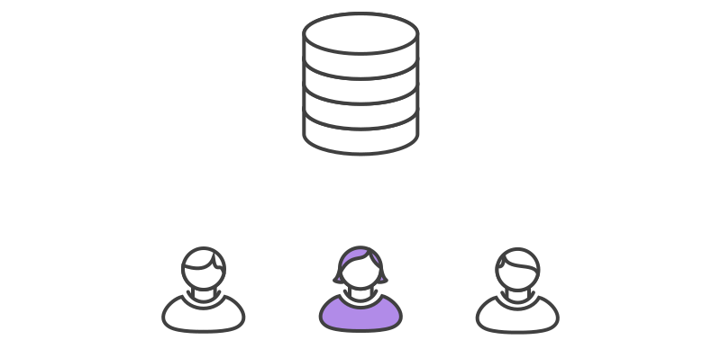
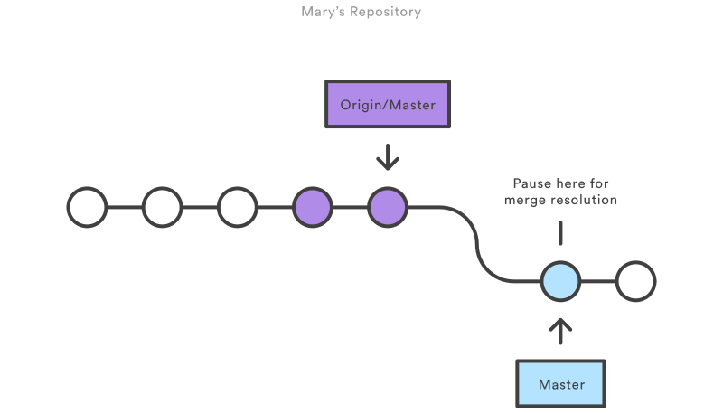
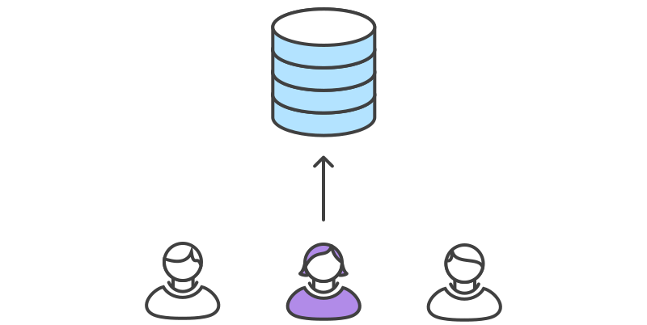

# 实例

让我们一起逐步分解来看看一个常见的小团队如何用这个工作流来协作的。有两个开发者小明和小红，看他们是如何开发自己的功能并提交到中央仓库上的。

## 有人先初始化好中央仓库


第一步，有人在服务器上创建好中央仓库。如果是新项目，你可以初始化一个空仓库；否则你要导入已有的`Git`或`SVN`仓库。

中央仓库应该是个裸仓库（`bare repository`），即没有工作目录（`working directory`）的仓库。可以用下面的命令创建：

```bash
ssh user@host git init --bare /path/to/repo.git
```

确保写上有效的`user`（`SSH`的用户名），`host`（服务器的域名或IP地址），`/path/to/repo.git`（你想存放仓库的位置）。
注意，为了表示是一个裸仓库，按照约定加上`.git`扩展名到仓库名上。

## 所有人克隆中央仓库


下一步，各个开发者创建整个项目的本地拷贝。通过`git clone`命令完成：

```bash
git clone ssh://user@host/path/to/repo.git
```

基于你后续会持续和克隆的仓库做交互的假设，克隆仓库时`Git`会自动添加远程别名`origin`指回父仓库。

## 小明开发功能


在小明的本地仓库中，他使用标准的`Git`过程开发功能：编辑、暂存（`Stage`）和提交。如果你不熟悉暂存区（`Staging Area`），这里说明一下：**暂存区** 用来准备一个提交，但可以不用把工作目录中所有的修改内容都包含进来。这样你可以创建一个高度聚焦的提交，尽管你本地修改很多内容。

```shell
git status # View the state of the repo
git add <some-file> # Stage a file
git commit # Commit a file</some-file>
```

请记住，因为这些命令生成的是本地提交，小明可以按自己需求反复操作多次，而不用担心中央仓库上有了什么操作。对需要多个更简单更原子分块的大功能，这个做法是很有用的。

## 小红开发功能


与此同时，小红在自己的本地仓库中用相同的编辑、暂存和提交过程开发功能。和小明一样，她也不关心中央仓库有没有新提交；当然更不关心小明在他的本地仓库中的操作，因为所有本地仓库都是私有的。

## 小明发布功能


一旦小明完成了他的功能开发，会发布他的本地提交到中央仓库中，这样其它团队成员可以看到他的修改。他可以用下面的`git push`命令:

```shell
git push origin master
```

注意，`origin`是在小明克隆仓库时`Git`创建的远程中央仓库别名。`master`参数告诉`Git`推送的分支。
由于中央仓库自从小明克隆以来还没有被更新过，所以`push`操作不会有冲突，成功完成。

## 小红试着发布功能


一起来看看在小明发布修改后，小红`push`修改会怎么样？她使用完全一样的`push`命令：

```shell
git push origin master
```

但她的本地历史已经和中央仓库有分岐了，`Git`拒绝操作并给出下面很长的出错消息：

```shell
error: failed to push some refs to '/path/to/repo.git'
hint: Updates were rejected because the tip of your current branch is behind
hint: its remote counterpart. Merge the remote changes (e.g. 'git pull')
hint: before pushing again.
hint: See the 'Note about fast-forwards' in 'git push --help' for details.
```

这避免了小红覆写正式的提交。她要先`pull`小明的更新到她的本地仓库合并上她的本地修改后，再重试。

## 小红在小明的提交之上`rebase`


小红用`git pull`合并上游的修改到自己的仓库中。
这条命令类似`svn update`——拉取所有上游提交命令到小红的本地仓库，并尝试和她的本地修改合并：

```shell
git pull --rebase origin master
```

`--rebase`选项告诉`Git`把小红的提交移到同步了中央仓库修改后的`master`分支的顶部，如下图所示：


如果你忘加了这个选项，`pull`操作仍然可以完成，但每次`pull`操作要同步中央仓库中别人修改时，提交历史会以一个多余的『合并提交』结尾。
对于集中式工作流，最好是使用`rebase`而不是生成一个合并提交。

## 小红解决合并冲突



`rebase`操作过程是把本地提交一次一个地迁移到更新了的中央仓库`master`分支之上。
这意味着可能要解决在迁移某个提交时出现的合并冲突，而不是解决包含了所有提交的大型合并时所出现的冲突。
这样的方式让你尽可能保持每个提交的聚焦和项目历史的整洁。反过来，简化了哪里引入`Bug`的分析，如果有必要，回滚修改也可以做到对项目影响最小。

如果小红和小明的功能是不相关的，不大可能在`rebase`过程中有冲突。如果有，`Git`在合并有冲突的提交处暂停`rebase`过程，输出下面的信息并带上相关的指令：

```shell
CONFLICT (content): Merge conflict in <some-file>
```



`Git`很赞的一点是，任何人可以解决他自己的冲突。在这个例子中，小红可以简单的运行`git status`命令来查看哪里有问题。
冲突文件列在`Unmerged paths`（未合并路径）一节中：

```shell
# Unmerged paths:
# (use "git reset HEAD <some-file>..." to unstage)
# (use "git add/rm <some-file>..." as appropriate to mark resolution)
#
# both modified: <some-file>
```

接着小红编辑这些文件。修改完成后，用老套路暂存这些文件，并让`git rebase`完成剩下的事：

```shell
git add <some-file>
git rebase --continue
```

要做的就这些了。`Git`会继续一个一个地合并后面的提交，如其它的提交有冲突就重复这个过程。

如果你碰到了冲突，但发现搞不定，不要惊慌。只要执行下面这条命令，就可以回到你执行`git pull --rebase`命令前的样子：

```shell
git rebase --abort
```

## 小红成功发布功能



小红完成和中央仓库的同步后，就能成功发布她的修改了：

```shell
git push origin master
```