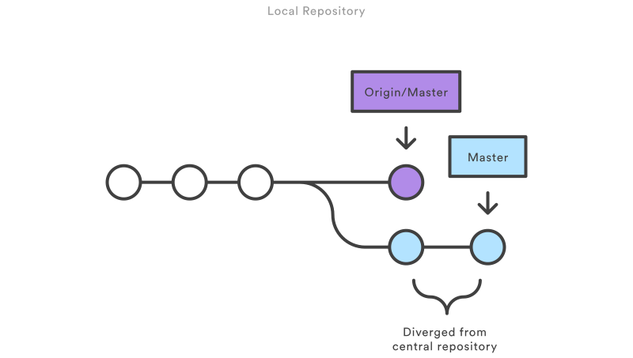

# How It Works

Like Subversion, the Centralized Workflow uses a central repository to serve as the single point-of-entry for all changes to the project. Instead of trunk, the default development branch is called master and all changes are committed into this branch. This workflow doesn’t require any other branches besides master.

Developers start by cloning the central repository. In their own local copies of the project, they edit files and commit changes as they would with SVN; however, these new commits are stored locally—they’re completely isolated from the central repository. This lets developers defer synchronizing upstream until they’re at a convenient break point.

To publish changes to the official project, developers “push” their local master branch to the central repository. This is the equivalent of svn commit, except that it adds all of the local commits that aren’t already in the central master branch.

## Managing Conflicts

The central repository represents the official project, so its commit history should be treated as sacred and immutable. If a developer’s local commits diverge from the central repository, Git will refuse to push their changes because this would overwrite official commits.

Before the developer can publish their feature, they need to fetch the updated central commits and rebase their changes on top of them. This is like saying, “I want to add my changes to what everyone else has already done.” The result is a perfectly linear history, just like in traditional SVN workflows.

If local changes directly conflict with upstream commits, Git will pause the rebasing process and give you a chance to manually resolve the conflicts. The nice thing about Git is that it uses the same git status and git add commands for both generating commits and resolving merge conflicts. This makes it easy for new developers to manage their own merges. Plus, if they get themselves into trouble, Git makes it very easy to abort the entire rebase and try again (or go find help).