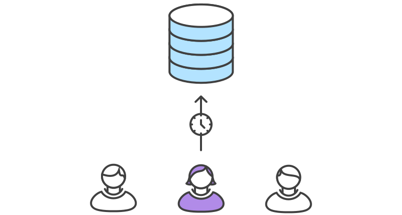
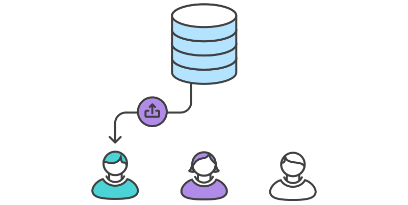

# 实例

下面的示例演示了如何把`Pull Requests`作为`Code Review`的方式，但注意`Pull Requests`可以用于很多其它的目的。

## 小红开始开发一个新功能


在开始开发功能前，小红需要一个独立的分支。使用下面的命令[新建一个分支](https://www.atlassian.com/git/tutorials/using-branches#git-checkout)：

```bash
git checkout -b marys-feature master
```

这个命令检出一个基于`master`名为`marys-feature`的分支，`Git`的`-b`选项表示如果分支还不存在则新建分支。
这个新分支上，小红按老套路编辑、暂存和提交修改，按需要提交以实现功能：

```bash
git status
git add <some-file>
git commit
```

## 小红要去吃个午饭




早上小红为新功能添加一些提交。
去吃午饭前，`push`功能分支到中央仓库是很好的做法，这样可以方便地备份，如果和其它开发协作，也让他们可以看到小红的提交。

```bash
git push -u origin marys-feature
```

这条命令`push` `marys-feature`分支到中央仓库（`origin`），`-u`选项设置本地分支去跟踪远程对应的分支。
设置好跟踪的分支后，小红就可以使用`git push`命令省去指定推送分支的参数。

## 小红完成功能开发


小红吃完午饭回来，完成整个功能的开发。[在合并到`master`之前](https://www.atlassian.com/git/tutorials/git-merge)，
她发起一个`Pull Request`让团队的其它人知道功能已经完成。但首先，她要确认中央仓库中已经有她最近的提交：

```bash
git push
```

然后，在她的`Git` `GUI`客户端中发起`Pull Request`，请求合并`marys-feature`到`master`，团队成员会自动收到通知。
`Pull Request`很酷的是可以在相关的提交旁边显示评注，所以你可以对某个变更集提问。

## 小黑收到`Pull Request`



小黑收到了`Pull Request`后会查看`marys-feature`的修改。决定在合并到正式项目前是否要做些修改，且通过`Pull Request`和小红来回地讨论。

## 小红再做修改


要再做修改，小红用和功能第一个迭代完全一样的过程。编辑、暂存、提交并`push`更新到中央仓库。小红这些活动都会显示在`Pull Request`上，小黑可以断续做评注。

如果小黑有需要，也可以把`marys-feature`分支拉到本地，自己来修改，他加的提交也会一样显示在`Pull Request`上。

## 小红发布她的功能


一旦小黑可以接受`Pull Request`，就可以合并功能到稳定项目代码中（可以由小黑或是小红来做这个操作）：

```bash
git checkout master
git pull
git pull origin marys-feature
git push
```

无论谁来做合并，首先要检出`master`分支并确认它是最新的。然后执行`git pull origin marys-feature`合并`marys-feature`分支到已经和远程一致的本地`master`分支。
你可以使用简单`git merge marys-feature`命令，但前面的命令可以保证总是最新的新功能分支。
最后更新的`master`分支要重新`push`回到`origin`。

这个过程常常会生成一个合并提交。有些开发者喜欢有合并提交，因为它像一个新功能和原来代码基线的连通符。
但如果你偏爱线性的提交历史，可以在执行合并时`rebase`新功能到`master`分支的顶部，这样生成一个快进（`fast-forward`）的合并。

一些`GUI`客户端可以只要点一下『接受』按钮执行好上面的命令来自动化`Pull Request`接受过程。
如果你的不能这样，至少在功能合并到`master`分支后能自动关闭`Pull Request`。

## 与此同时，小明在做和小红一样的事

当小红和小黑在`marys-feature`上工作并讨论她的`Pull Request`的时候，小明在自己的功能分支上做完全一样的事。通过隔离功能到独立的分支上，每个人都可以自主的工作，当然必要的时候在开发者之间分享变更还是比较繁琐的。