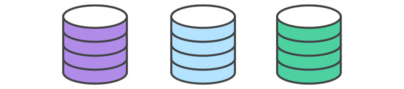
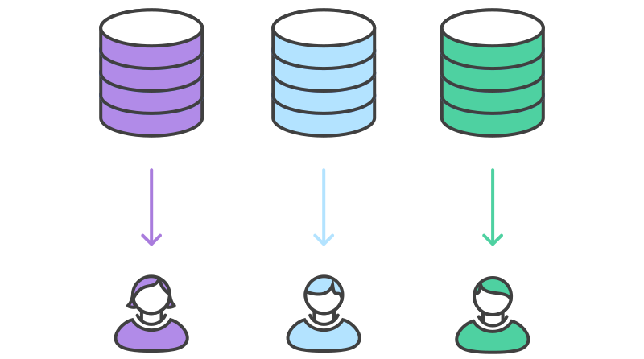
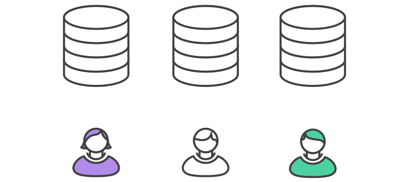

# 示例

## 项目维护者初始化正式仓库


和任何使用`Git`项目一样，第一步是创建在服务器上一个正式仓库，让所有团队成员都可以访问到。通常这个仓库也会作为项目维护者的公开仓库。

公开仓库应该是裸仓库，不管是不是正式代码库。所以项目维护者会运行像下面的命令来搭建正式仓库：

```bash
ssh user@host
git init --bare /path/to/repo.git
```

`Bitbucket`和`Stash`提供了一个方便的`GUI`客户端以完成上面命令行做的事。这个搭建中央仓库的过程和前面提到的工作流完全一样。如果有现存的代码库，维护者也要`push`到这个仓库中。

## 开发者`fork`正式仓库



其它所有的开发需要`fork`正式仓库。可以用`git clone`命令用`SSH`协议连通到服务器，拷贝仓库到服务器另一个位置 —— 是的，`fork`操作基本上就只是一个服务端的克隆。`Bitbucket`和`Stash`上可以点一下按钮就让开发者完成仓库的`fork`操作。

这一步完成后，每个开发都在服务端有一个自己的仓库。和正式仓库一样，这些仓库应该是裸仓库。

## 开发者克隆自己`fork`出来的仓库



下一步，各个开发者要克隆自己的公开仓库，用熟悉的`git clone`命令。

在这个示例中，假定用`Bitbucket`托管了仓库。记住，如果这样的话各个开发者需要有各自的`Bitbucket`账号，
使用下面命令克隆服务端自己的仓库：

```bash
git clone https://user@bitbucket.org/user/repo.git
```

相比前面介绍的工作流只用了一个`origin`远程别名指向中央仓库，`Forking`工作流需要2个远程别名 ——
一个指向正式仓库，另一个指向开发者自己的服务端仓库。别名的名字可以任意命名，常见的约定是使用`origin`作为远程克隆的仓库的别名
（这个别名会在运行`git clone`自动创建），`upstream`（上游）作为正式仓库的别名。

```bash
git remote add upstream https://bitbucket.org/maintainer/repo
```

需要自己用上面的命令创建`upstream`别名。这样可以简单地保持本地仓库和正式仓库的同步更新。
注意，如果上游仓库需要认证（比如不是开源的），你需要提供用户：

```bash
git remote add upstream https://user@bitbucket.org/maintainer/repo.git
```

这时在克隆和`pull`正式仓库时，需要提供用户的密码。

## 开发者开发自己的功能



在刚克隆的本地仓库中，开发者可以像其它工作流一样的编辑代码、提交修改和新建分支:

```bash
git checkout -b some-feature
# Edit some code
git commit -a -m "Add first draft of some feature"
```

所有的修改都是私有的直到`push`到自己公开仓库中。如果正式项目已经往前走了，可以用`git pull`命令获得新的提交：

```bash
git pull upstream master
```

由于开发者应该都在专门的功能分支上工作，`pull`操作结果会都是快进合并:

## 开发者发布自己的功能


一旦开发者准备好了分享新功能，需要做二件事。
首先，通过`push`他的贡献代码到自己的公开仓库中，让其它的开发者都可以访问到。
他的`origin`远程别名应该已经有了，所以要做的就是：

```bash
git push origin feature-branch
```

这里和之前的工作流的差异是，`origin`远程别名指向开发者自己的服务端仓库，而不是正式仓库。

第二件事，开发者要通知项目维护者，想要合并他的新功能到正式库中。
`Bitbucket`和`Stash`提供了`Pull Request`按钮，弹出表单让你指定哪个分支要合并到正式仓库。
一般你会想集成你的功能分支到上游远程仓库的`master`分支中。

## 项目维护者集成开发者的功能


当项目维护者收到`pull request`，他要做的是决定是否集成它到正式代码库中。有二种方式来做：

1. 直接在`pull request`中查看代码
1. `pull`代码到他自己的本地仓库，再手动合并

第一种做法更简单，维护者可以在`GUI`中查看变更的差异，做评注和执行合并。
但如果出现了合并冲突，需要第二种做法来解决。这种情况下，维护者需要从开发者的服务端仓库中`fetch`功能分支，
合并到他本地的`master`分支，解决冲突：

```bash
git fetch https://bitbucket.org/user/repo feature-branch
# Inspect the changes
git checkout master
git merge FETCH_HEAD
```

变更集成到本地的`master`分支后，维护者要`push`变更到服务器上的正式仓库，这样其它的开发者都能访问到：

```bash
git push origin master
```

注意，维护者的`origin`是指向他自己公开仓库的，即是项目的正式代码库。到此，开发者的贡献完全集成到了项目中。

## Developers synchronize with the official repository


由于正式代码库往前走了，其它的开发需要和正式仓库做同步：

```bash
git pull upstream master
```