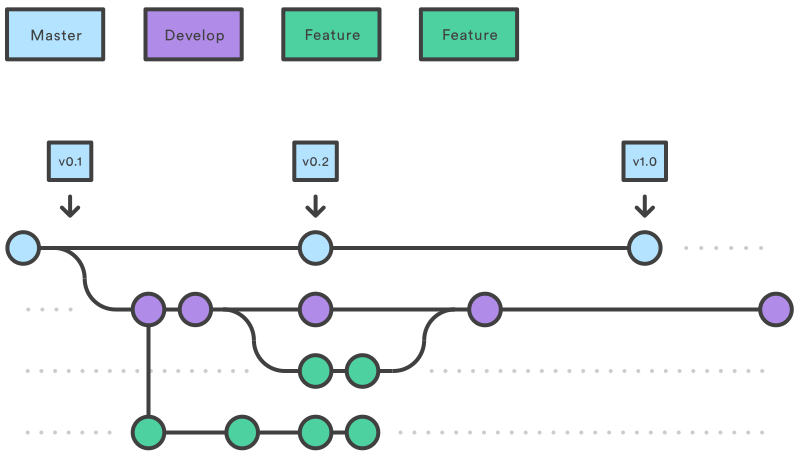

# How It Works

The Gitflow Workflow still uses a central repository as the communication hub for all developers. And, as in the other workflows, developers work locally and push branches to the central repo. The only difference is the branch structure of the project.

## Historical Branches

Instead of a single master branch, this workflow uses two branches to record the history of the project. The master branch stores the official release history, and the develop branch serves as an integration branch for features. It's also convenient to tag all commits in the master branch with a version number.

The rest of this workflow revolves around the distinction between these two branches.

## Feature Branches

Each new feature should reside in its own branch, which can be pushed to the central repository for backup/collaboration. But, instead of branching off of master, feature branches use develop as their parent branch. When a feature is complete, it gets merged back into develop. Features should never interact directly with master.

Note that feature branches combined with the develop branch is, for all intents and purposes, the Feature Branch Workflow. But, the Gitflow Workflow doesn’t stop there.

## Release Branches

Once develop has acquired enough features for a release (or a predetermined release date is approaching), you fork a release branch off of develop. Creating this branch starts the next release cycle, so no new features can be added after this point—only bug fixes, documentation generation, and other release-oriented tasks should go in this branch. Once it's ready to ship, the release gets merged into master and tagged with a version number. In addition, it should be merged back into develop, which may have progressed since the release was initiated.

Using a dedicated branch to prepare releases makes it possible for one team to polish the current release while another team continues working on features for the next release. It also creates well-defined phases of development (e.g., it's easy to say, “this week we're preparing for version 4.0” and to actually see it in the structure of the repository).

Common conventions:

* branch off: develop
* merge into: master
* naming convention: release-* or release/*

## Maintenance Branches

Maintenance or “hotfix” branches are used to quickly patch production releases. This is the only branch that should fork directly off of master. As soon as the fix is complete, it should be merged into both master and develop (or the current release branch), and master should be tagged with an updated version number.

Having a dedicated line of development for bug fixes lets your team address issues without interrupting the rest of the workflow or waiting for the next release cycle. You can think of maintenance branches as ad hoc release branches that work directly with master.
