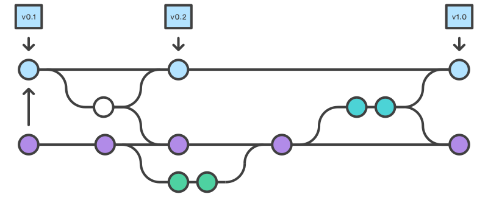

# Gitflow 工作流

这节介绍的[`Gitflow`工作流](http://nvie.com/posts/a-successful-git-branching-model/)借鉴自在[nvie](http://nvie.com/)的*Vincent Driessen*。

`Gitflow`工作流定义了一个围绕项目发布的严格分支模型。虽然比功能分支工作流复杂几分，但提供了用于一个健壮的用于管理大型项目的框架。

`Gitflow`工作流没有用超出功能分支工作流的概念和命令，而是为不同的分支分配一个很明确的角色，并定义分支之间如何和什么时候进行交互。
除了使用功能分支，在做准备、维护和记录发布也使用各自的分支。
当然你可以用上功能分支工作流所有的好处：`Pull Requests`、隔离实验性开发和更高效的协作。