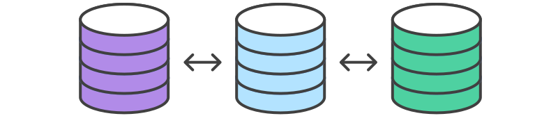

# Comparing Workflows

* [Centralized Workflow](centralized_workflow/)
* [Feature Branch Workflow](feature_branch_workflow/)
* [Gitflow Workflow](gitflow_workflow/)
* [Forking Workflow](forking_workflow/)

The array of possible workflows can make it hard to know where to begin when implementing Git in the workplace. This page provides a starting point by surveying the most common Git workflows for enterprise teams.

As you read through, remember that these workflows are designed to be guidelines rather than concrete rules. We want to show you what’s possible, so you can mix and match aspects from different workflows to suit your individual needs.
