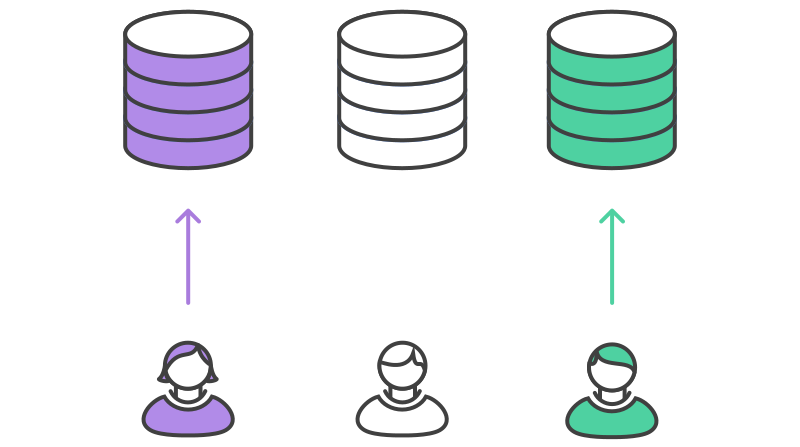

# Example

## The project maintainer initializes the official repository


As with any Git-based project, the first step is to create an official repository on a server accessible to all of the team members. Typically, this repository will also serve as the public repository of the project maintainer.

Public repositories should always be bare, regardless of whether they represent the official codebase or not. So, the project maintainer should run something like the following to set up the official repository:

```bash
ssh user@host
git init --bare /path/to/repo.git
```

Bitbucket also provides a convenient GUI alternative to the above commands. This is the exact same process as setting up a central repository for the other workflows in this tutorial. The maintainer should also push the existing codebase to this repository, if necessary.

## Developers fork the official repository


Next, all of the other developers need to fork this official repository. It’s possible to do this by SSH’ing into the server and running git clone to copy it to another location on the server—yes, forking is basically just a server-side clone. But again, Bitbucket let developers fork a repository with the click of a button.

After this step, every developer should have their own server-side repository. Like the official repository, all of these should be bare repositories.

## Developers clone their forked repositories


Next each developer needs to clone their own public repository. They can do with the familiar git clone command.

Our example assumes the use of Bitbucket to host these repositories. Remember, in this situation, each developer should have their own Bitbucket account and they should clone their server-side repository using:

```bash
git clone https://user@bitbucket.org/user/repo.git
```

Whereas the other workflows in this tutorial use a single origin remote that points to the central repository, the Forking Workflow requires two remotes—one for the official repository, and one for the developer’s personal server-side repository. While you can call these remotes anything you want, a common convention is to use origin as the remote for your forked repository (this will be created automatically when you run git clone) and upstream for the official repository.

```bash
git remote add upstream https://bitbucket.org/maintainer/repo
```

You’ll need to create the upstream remote yourself using the above command. This will let you easily keep your local repository up-to-date as the official project progresses. Note that if your upstream repository has authentication enabled (i.e., it's not open source), you'll need to supply a username, like so:

```bash
git remote add upstream https://user@bitbucket.org/maintainer/repo.git
```

This requires users to supply a valid password before cloning or pulling from the official codebase.

## Developers work on their features


In the local repositories that they just cloned, developers can edit code, commit changes, and create branches just like they did in the other workflows:

```bash
git checkout -b some-feature
# Edit some code
git commit -a -m "Add first draft of some feature"
```

All of their changes will be entirely private until they push it to their public repository. And, if the official project has moved forward, they can access new commits with git pull:

```bash
git pull upstream master
```

Since developers should be working in a dedicated feature branch, this should generally result in a fast-forward merge.

## Developers publish their features



Once a developer is ready to share their new feature, they need to do two things. First, they have to make their contribution accessible to other developers by pushing it to their public repository. Their origin remote should already be set up, so all they should have to do is the following:

```bash
git push origin feature-branch
```

This diverges from the other workflows in that the origin remote points to the developer’s personal server-side repository, not the main codebase.

Second, they need to notify the project maintainer that they want to merge their feature into the official codebase. Bitbucket provides a “Pull request” button that leads to a form asking you to specify which branch you want to merge into the official repository. Typically, you’ll want to integrate your feature branch into the upstream remote’s master branch.

## The project maintainer integrates their features


When the project maintainer receives the pull request, their job is to decide whether or not to integrate it into the official codebase. They can do this in one of two ways:

1. Inspect the code directly in the pull request
1. Pull the code into their local repository and manually merge it

The first option is simpler, as it lets the maintainer view a diff of the changes, comment on it, and perform the merge via a graphical user interface. However, the second option is necessary if the pull request results in a merge conflict. In this case, the maintainer needs to fetch the feature branch from the developer’s server-side repository, merge it into their local master branch, and resolve any conflicts:

```bash
git fetch https://bitbucket.org/user/repo feature-branch
# Inspect the changes
git checkout master
git merge FETCH_HEAD
```

Once the changes are integrated into their local master, the maintainer needs to push it to the official repository on the server so that other developers can access it:

```bash
git push origin master
```

Remember that the maintainer's origin points to their public repository, which also serves as the official codebase for the project. The developer's contribution is now fully integrated into the project.

## Developers synchronize with the official repository


Since the main codebase has moved forward, other developers should synchronize with the official repository:

```bash
git pull upstream master
```